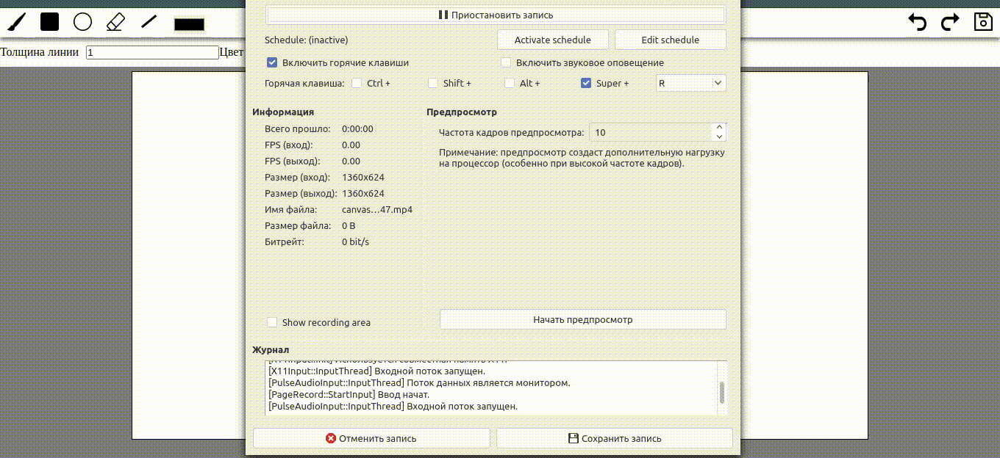

# Доска для рисования

Приложение наподобие доски для рисовния , работает без бэкенда. Приложение придумал не я , создавал его по видио из ютуба https://www.youtube.com/watch?v=KVeMsy4qCdg&feature=youtu.be . В будущем планирую сделать кнопку сохранить и сделать отправку данных на бэкенд.
#
#### Можно :
- изменять цвет и толщину фигур и линий .
- рисовать фигурами: круг , прямоугольник , прямая линия . 
- рисовать с помощью мышки .
- стерать нарисованное с помощью ластика .
- отменять и возвращать последний нарисованный рисунок .
